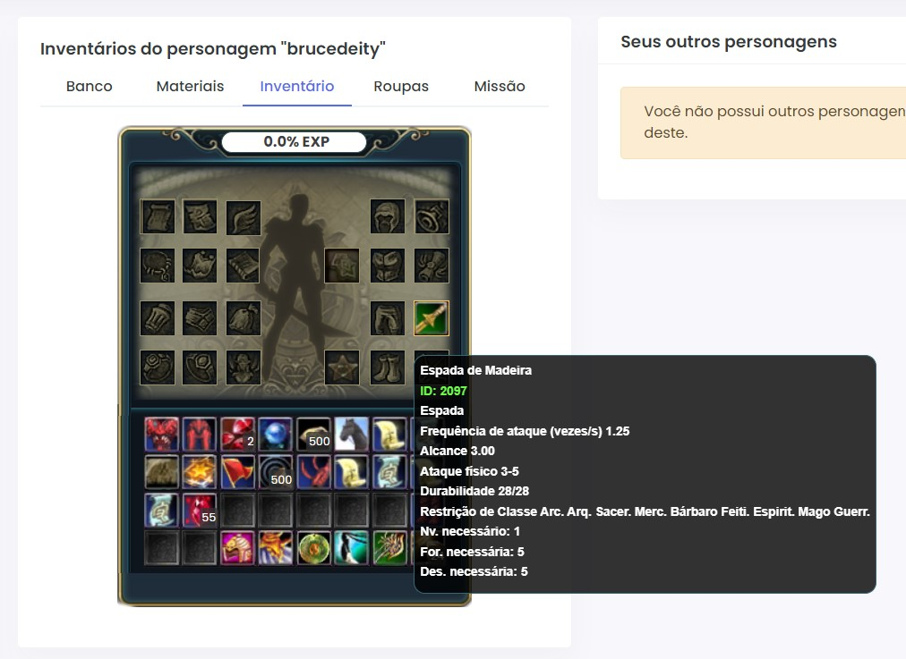

## From this:
`0100ff010500000005000000f00a0000f00a00002c00030000000000010000000000000000000000030000000500000000000000000000001000000000004040000000000000000000000000`

## To this:


This project decodes PW's hexadecimal strings based on their predefined structure.

## Features

- Decode the structure for Weapon, Armor, Fashion, Jewelry, Flight, Role Property, and more.
- Retrieve the decoded data as JSON.
- Error handling and validation for input data.

## Installation

Install the package via Composer:

```bash
   composer require brucedeity/pwhexparser
```
## Example Usage

Here's an example of how to use the PWHexParser library:

```php
   <?php

   require __DIR__ . '/../vendor/autoload.php';

   $decoder = new App\Decoder();
   $decoder->setItemType('Fashion'); // Options: Weapon, Armor, Charm, Jewelry, Flight, Card...
   $decoder->sethexString('1e00000092470100010a620072007500630065000000'); // Mandarin Silk Gown
   $result = $decoder->decode();

   header('Content-Type: application/json');
   echo json_encode($result, JSON_PRETTY_PRINT);
```
### Output:
```json
   {
     "level_req": 30,
     "color": 18322,
     "gender": 1,
     "creator_type": 1,
     "name_length": 5,
     "name": "bruce",
     "color_mask": 0
   }
```
### Guessing Item Type

You can also guess the item type based on the item's mask:

```php
   <?php

   require __DIR__ . '/../vendor/autoload.php';

   $mask = 1; // Weapon

   $decoder = new App\Decoder();
   $decoder->guessItemType($mask);
   $decoder->sethexString('5a00ff001001000031000000b4610000786900002c00040a4200720075006300650000000000090000000b00000000000000930200009b0500000000000000000000180000000000604000000000010000000000000003000000114500009200000001000000f02300004d000000cf2500000e000000');
   $result = $decoder->decode();

   header('Content-Type: application/json');
   echo json_encode($result, JSON_PRETTY_PRINT);
```
### Output:

```json
   {
     "level": 90,
     "class": 255,
     "strength": 272,
     "vitality": 0,
     "dexterity": 49,
     "magic": 0,
     "min_durability": 250,
     "max_durability": 270,
     "item_type": 44,
     "item_flag": 4,
     "name_length": 10,
     "name": "Bruce",
     "ranged_type": 0,
     "weapon_type": 9,
     "weapon_grade": 11,
     "ammunition_type": 0,
     "min_physical_damage": 659,
     "max_physical_damage": 1435,
     "min_magic_damage": 0,
     "max_magic_damage": 0,
     "attack_rate": 0.83,
     "attack_range": 3.5,
     "minimum_range": 0,
     "sockets_count": 1,
     "sockets": [0],
     "addons_count": 3,
     "addons": {
       "special_addons": [
         {
           "id": 1297,
           "value": 146,
           "level": 1
         }
       ],
       "normal_addons": [
         {
           "id": 1008,
           "value": 77
         },
         {
           "id": 1487,
           "value": 14
         }
       ],
       "refine_addons": [],
       "socket_addons": []
     }
   }
```
### Translating Fields

```php
   <?php

   $mask = 1; // Weapon

   $decoder = new Decoder();
   $decoder->guessItemType($mask);
   $decoder->setLang('pt-BR');
   $decoder->sethexString('64002000360000002e0100008c7b0000007d00002c000406480075007a0002000000c55c00000f00000000000000ad02000004040000000000000000000010000000000020400000000002000900d0070000d007000005000000db21000003000000852500005e010000cc25000012000000e1a1000064000000e1a1000064000000');

   echo json_encode($decoder->translate(), JSON_PRETTY_PRINT);
```
### Output:

```json
   {
     "item_type": {
       "translated": "item_type",
       "value": 44
     },
     "weapon_type": {
       "translated": "weapon_type",
       "value": 23749
     },
     "weapon_grade": {
       "translated": "Nv.",
       "value": 15
     },
     "attack_rate": {
       "translated": "Frequência de ataque (vezes/s)",
       "value": 1.25
     },
     "attack_range": {
       "translated": "Alcance",
       "value": 2.5
     },
     "physical_damage": {
       "translated": "Ataque físico",
       "value": "685-1028"
     },
     "magic_damage": {
       "translated": "AtqM",
       "value": "0-0"
     },
     "durability": {
       "translated": "Durabilidade",
       "value": "316/320"
     },
     "ammunition_type": {
       "translated": "Tipo de Munição",
       "value": 0
     },
     "class": {
       "translated": "Restrição de Classe",
       "value": 32
     },
     "level": {
       "translated": "Nv. necessário:",
       "value": 100
     },
     "strength": {
       "translated": "For. necessária:",
       "value": 54
     },
     "vitality": {
       "translated": "Con. necessária:",
       "value": 0
     },
     "dexterity": {
       "translated": "Des. necessária:",
       "value": 302
     },
     "magic": {
       "translated": "Int. necessária",
       "value": 0
     },
     "minimum_range": {
       "translated": "Dist. Fragilidade",
       "value": 0
     },
     "sockets_count": {
       "translated": "sockets_count",
       "value": 2
     },
     "sockets": {
       "translated": "sockets",
       "value": [
         2000,
         2000
       ]
     },
     "addons_count": {
       "translated": "addons_count",
       "value": 5
     },
     "addons": {
       "translated": "addons",
       "value": {
         "special_addons": [],
         "normal_addons": [
           {
             "id": 475,
             "value": 3
           },
           {
             "id": 1413,
             "value": 350
           },
           {
             "id": 1484,
             "value": 18
           }
         ],
         "refine_addons": [],
         "socket_addons": [
           {
             "index": 1,
             "id": 481,
             "value": 100
           },
           {
             "index": 2,
             "id": 481,
             "value": 100
           }
         ]
       }
     },
     "name": {
       "translated": "Feito por",
       "value": "Huz"
     }
   }
```